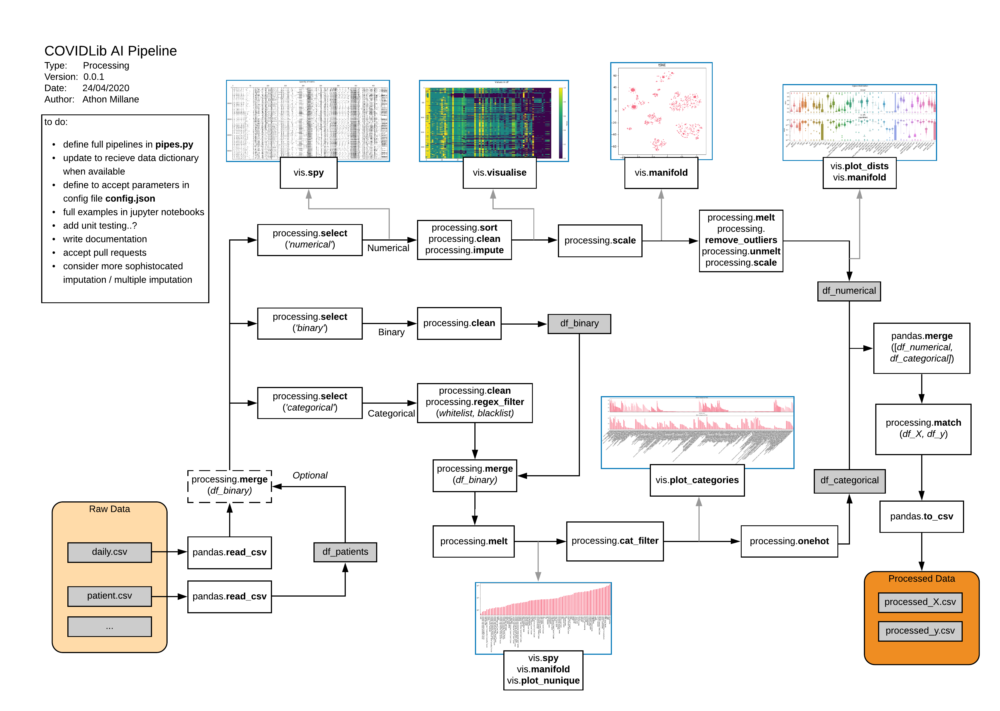

# COVID19_RandomForest
### *UQ ECMOCARD Data Analysis Pipeline*

### Acknowledgment:
- This project has included random forest models for COVID-19 project from https://github.com/athon-millane/covidlib
---
### Rationale:
- `Pandas`, `SKLearn`, and `Matplotlib` are fantastic tools but have big featuresets and take quite a while to learn and use intuitively.
- The goal of this library is to capture as much functionality and utility as needed for visualising and experimenting with processing techniques, models, and explainability techniuqes, while hiding the machinery from those who aren't familiar with it.
- Functions in `processing.py` are all designed to be used in pipelines using the pandas `pipe` functionality. This means they must recieve a DataFrame (`df`) and return a `df`. Arguments should have default values but should also be played with. If an underlying library/function is called in the pipeline, keyword arguments should be accessible from the pipe function.
- Functions in `vis.py` are similar in that they recieve and return a `df`, however don't (shouldn't at least) permute the `df`. See data pipeline to illustrate.
- `manifold.py` contains utils for applying and visualising manifold learning/dimensionality reduction techniques.
- `explanations.py` is in early development, but contains utils for applying and visualising modelling and explainability techniques.
- `pipelines.py` will be an even more abstracted interface where users can simply define pipeline parameters as a nested dictionary (`.json` object) then instantiate the entire thing with very minimal code. Yet to make significant process.
---
### Install instructions:
- **Locally (with Conda):** Ensure [conda](https://docs.conda.io/en/latest/miniconda.html) is installed, then run `conda env create -f env.yml .` followed by `conda activate COVID19_RandomForest` to activate environment, then `jupyter lab` to instantiate notebook IDE.
- **Locally (with Pip + virtualenv):** Just run `source pip-install.sh`. This is a simple script that creates a virtualenv, installs requirements and starts JupyterLab.
- **With Docker:** Ensure [docker](https://docs.docker.com/get-docker/) is installed, then run `docker-compose up` and follow instructions. This will spin up a local version of JupyterLab which you can use in your browser.

---
### Downloading data:
- If you don't have an API token, download the data fom the UQ server and place it in here. 
  - For example, if you download the data on the **10th of April**, put the csv files in `data/data_deidentified/v0.1.0_2020_04_10`.
- Go to [`config.py`](../src/config.py) and set the `LATEST` parameter to whichever data version you want to point to.

---
### Starting point:
- Notebotebook for regression random forest in relation to "COMPLIANCE_RESPIRATORY-SYSTEM" is [`compliance_regression.ipynb`](notebooks/experiments/compliance_regression.ipynb). 
- Notebotebook for binary-classification random forest in relation to "MORTALITY" is [`outcome_BinaryClassifier.ipynb`](notebooks/experiments/outcome_BinaryClassifier.ipynb). 
- Notebotebook for multi-classification random forest in relation to "MORTALITY" is [`outcome_MultiClassifier.ipynb`](notebooks/experiments/outcome_MultiClassifier.ipynb). 

---
### To do:
- [ ] Fix existing examples to run end to end.
- [ ] Add docstrings to functions (maybe create a simple readthedocs).
- [ ] Notebook demos for full pipelines (processing, training+inference, explainability).
- [ ] Dockerise for platform extensibility.
- [ ] Add pull requests!
---
### Current process flow for Data Pipeline:

---
